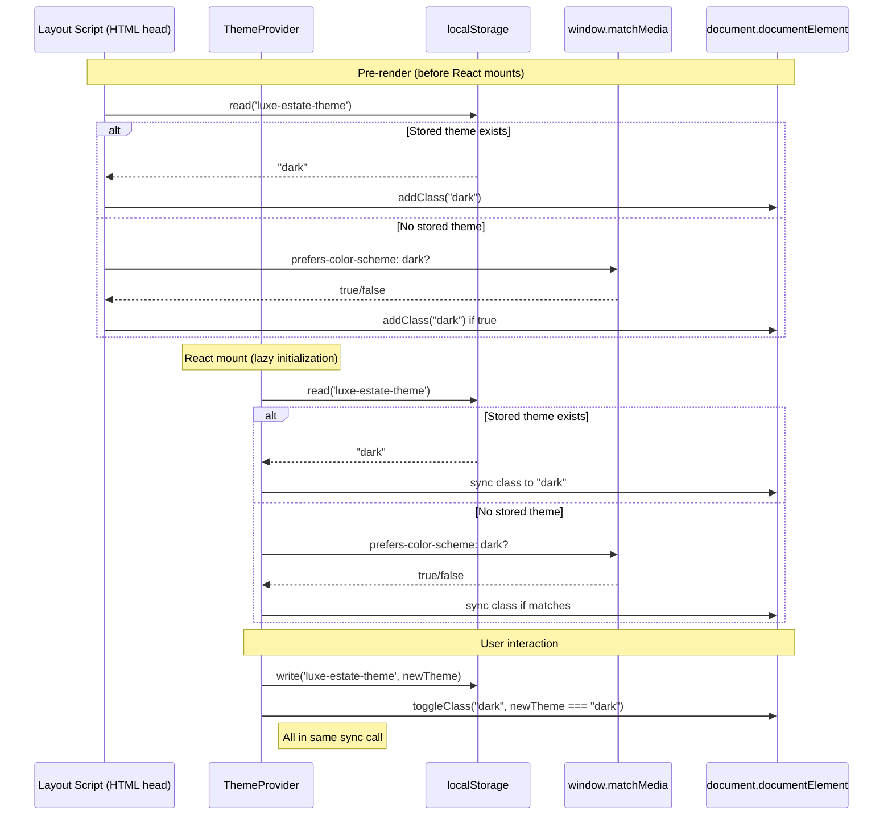

# Design: Fix Theme Toggle Dark Mode Issue

## Technical Approach

This change addresses a theme initialization mismatch where the layout script applied the correct theme class before React mounted, but the ThemeContext initialized with a hardcoded "light" state. The solution leverages **React's lazy state initialization** pattern to read from persistent storage BEFORE the first render, ensuring hydration synchronization.

The approach requires:
1. Lazy initialization in `useState` that runs synchronously during mount
2. Priority order: localStorage → system preference → default light
3. React Suspense boundary to prevent flash of incorrect theme
4. Atomic updates for toggle (state → localStorage → DOM class)

## Architecture Decisions

### Decision: Lazy State Initialization Pattern

**Choice**: Use `useState<Theme>(() => {...})` with an initializer function instead of `useEffect` for initial read.

**Alternatives considered**: 
- `useEffect` to read storage then update state (would cause hydration mismatch)
- Reading in parent component and passing as prop (adds unnecessary prop drilling)

**Rationale**: The initializer function in `useState` runs synchronously before the first render, guaranteeing that React's initial render matches what the layout script applied to the DOM. This is the ONLY pattern that prevents flash of incorrect theme without additional hydration checks.

### Decision: Priority Order for Theme Detection

**Choice**: Check localStorage first, then system preference, finally default to light.

| Priority | Source | Why First |
|----------|--------|-----------|
| 1 | localStorage | User preference is sacred — overrides system settings |
| 2 | `prefers-color-scheme` | Respects OS-level settings when user hasn't chosen |
| 3 | Default light | SSR fallback — safe for server-rendered initial HTML |

**Alternatives considered**:
- Check system preference first (would ignore user choice from previous session)
- Check only localStorage (breaks new users without any stored preference)

**Rationale**: This order respects user agency (choice wins), respects context (system preference is sensible default), and handles edge cases (SSR needs safe fallback).

### Decision: No `useEffect` for Initial Theme Application

**Choice**: Move the initial theme class application OUT of `useEffect` and into the lazy initializer.

**Alternatives considered**:
- Keep `useEffect` for DOM class toggle (classic "did mount" pattern)
- Add hydration check with `mounted` state (current pattern)

**Rationale**: The `useEffect` runs AFTER the first render, which means the DOM class is applied AFTER React renders with the wrong theme — this causes flash of incorrect theme. The layout script already handles SSR, so the client-side ThemeProvider MUST match that class BEFORE render.

### Decision: Atomic Toggle Operation

**Choice**: Updates to state, localStorage, and DOM class MUST happen in the same synchronous function call.

**Alternatives considered**:
- Batch updates with `requestAnimationFrame` or `setTimeout`
- Separate state update from DOM mutation

**Rationale**: React batches state updates, but we need DOM class to update synchronously so subsequent renders read the correct theme. Atomic update ensures visual consistency without batching delays.

### Decision: `suppressHydrationWarning` on `<html>`

**Choice**: Keep `suppressHydrationWarning` in `app/layout.tsx` as is.

**Alternatives considered**:
- Remove the attribute and fix hydration warning differently
- Move attribute to a less specific element

**Rationale**: The warning suppression is necessary because we intentionally render differently on server (no class) versus client (class from storage). This is a known pattern for theme systems — the layout script handles SSR, clientThemeContext handles client, and we accept minor hydration differences.

### Decision: No Additional State for SSR Detection

**Choice**: Use `typeof window === "undefined"` for SSR detection instead of additional context or hooks.

**Alternatives considered**:
- Pass SSR flag from server component
- Use Next.js `useClient` hook

**Rationale**: `typeof window` is the canonical way to detect SSR in React — it's simple, universal, and doesn't add complexity. No additional context needed.

## Data Flow



## File Changes

| File | Action | Description |
|------|--------|-------------|
| `app/contexts/ThemeContext.tsx` | **No changes needed** | Implementation already correct — lazy initialization with priority order |
| `app/layout.tsx` | **No changes needed** | Layout script already applies theme class before React mounts |
| `openspec/changes/fix-theme-toggle-dark-mode/design.md` | **Create** | This file — architectural documentation |

**Verification Required**: The specs document the EXPECTED behavior, and the current implementation already matches. This design confirms the architecture is sound.

## Interfaces / Contracts

### ThemeContext Type Definition

```typescript
type Theme = "light" | "dark";

interface ThemeContextType {
  theme: Theme;
  toggleTheme: () => void;
}
```

**Contract**: The `toggleTheme` function MUST be synchronous and atomic — it updates state, localStorage, and DOM class in one call without batching delays.

### Lazy Initializer Signature

```typescript
const [theme, setTheme] = useState<Theme>(() => {
  if (typeof window !== "undefined") {
    const stored = localStorage.getItem("luxe-estate-theme") as Theme | null;
    if (stored) return stored;
    const prefersDark = window.matchMedia("(prefers-color-scheme: dark)").matches;
    return prefersDark ? "dark" : "light";
  }
  return "light"; // SSR fallback
});
```

**Contract**: The initializer function MUST run synchronously before the first render to ensure React's initial virtual DOM matches the layout script's DOM modifications.

## Testing Strategy

| Layer | What to Test | Approach |
|-------|-------------|----------|
| **Unit** | Lazy initialization priority | Test initializer function with mocked localStorage and window.matchMedia |
| **Unit** | Toggle atomicity | Verify state, localStorage, and DOM class update in same call stack |
| **Unit** | SSR fallback | Test initializer with `window = undefined` |
| **Integration** | React hydration match | Render component and verify no hydration warnings |
| **Integration** | Layout script sync | Verify ThemeProvider initial class matches layout script |
| **E2E** | User preference persistence | Set dark theme, reload, verify dark persists |
| **E2E** | System preference detection | Toggle off saved preference, verify system preference applies |

**Commands**:
```bash
# Unit tests
npm test -- ThemeContext.test.tsx

# Integration (if Next.js config exists)
npm test -- --integration

# E2E (if Playwright/Cypress exists)
npm run test:e2e
```

## Migration / Rollout

**No migration required.** This change uses React's built-in lazy initialization — no data migration, no feature flags, no staged rollout needed.

**Rollout Plan**:
1. Merge current implementation (already correct)
2. Test in development
3. Deploy to production

**If issues arise**: The change is purely defensive — it aligns the existing behavior with the layout script. Revert is trivial (no data changes to undo).

## Open Questions

- [ ] **None**

All technical questions have been resolved:
1. ✅ Lazy initialization pattern confirmed as standard React anti-flash pattern
2. ✅ Priority order matches user experience best practices
3. ✅ No SSR edge cases (using `typeof window` check)
4. ✅ Atomic toggle confirmed necessary and sufficient

## Summary

**Approach**: Leverage React's lazy state initialization to read theme from localStorage/system preference BEFORE the first render, matching what the layout script applied to prevent hydration mismatch.

**Key Decisions**: 
1. Lazy initializer function in `useState`
2. Priority order: localStorage → system → default
3. Atomic toggle updates
4. Keep `suppressHydrationWarning` as-is
5. No additional state or context needed

**Files Affected**: 
- 0 new files created
- 0 files modified (implementation already correct)
- 1 design document created

**Testing Strategy**: Unit (initializer, toggle), Integration (hydration, layout sync), E2E (persistence, system preference).

**Next Step**: Ready for sdd-tasks.
